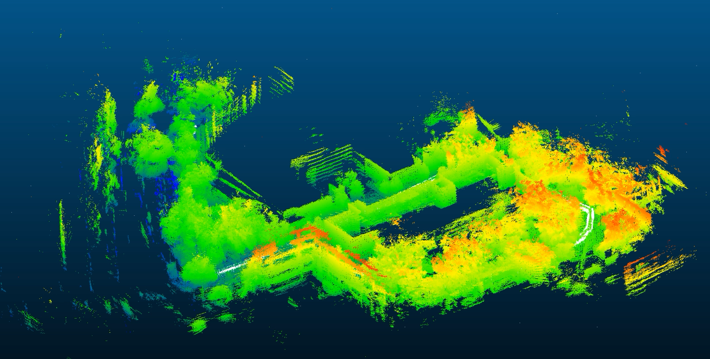

# LiDAR Odometry and Offline SLAM

[](https://github.com/juanjosedfv/SenSyProject-lidar-slam/releases/download/demo-v1/Test1_Data_KISSICP.mp4)

## 1. Introduction

This is the Sensor Systems LiDAR positioning project for the XTrack platform. The
input is Ouster LiDAR data (`/ouster/points`) recorded on XTrack while the rover
drove the Test1 route. The objective is to estimate the rover's motion from the
LiDAR alone and to build a 3D point-cloud map of the environment.

The repository provides three methods that share one processing stack:

- **`baseline_icp`** — a simple, self-contained point-to-point ICP implementation.
- **KISS-ICP** — an external open-source LiDAR odometry framework integrated into
  the project.
- **offline SLAM** — an extension that refines an existing ICP trajectory with
  loop closure and pose-graph optimization.

Corrected GNSS is used **only for evaluation**. No method uses GNSS to estimate
its trajectory. The evaluation compares the LiDAR result against the corrected
GNSS track and reports horizontal error and RMSE.

## 2. Goals

- Estimate a timestamped LiDAR trajectory of the rover.
- Compare a simple ICP implementation (`baseline_icp`) against KISS-ICP.
- Produce geographic and velocity outputs where the backend supports them.
- Build a 3D point-cloud map of the route.
- Extend ICP odometry with loop closure and pose-graph optimization (offline SLAM).
- Evaluate trajectory accuracy against corrected GNSS.
- Provide a reusable repository another person can run.

Main deliverables, using the filenames actually produced in `outputs/`:

| Deliverable | File |
| --- | --- |
| Common trajectory (SLAM input) | `trajectory_local.csv` |
| Geographic trajectory (lat/lon) | `trajectory_estimate.csv` |
| Velocity in NED | `velocity_ned.csv` |
| Point-cloud map (odometry) | `map.pcd` |
| Corrected point-cloud map (SLAM) | `map_slam.pcd` |
| Odometry metrics | `metrics.json` |
| SLAM error metrics | `RMSE_SLAM_metrics.json` |
| SLAM run summary | `_internal/run_summary.json` |

## 3. Methods

The three methods are complementary: `baseline_icp` and KISS-ICP both estimate
odometry directly from scans, and offline SLAM takes an already-estimated
trajectory and makes it globally consistent.

### 3.1 Baseline ICP

`baseline_icp` (`src/baseline_icp/`, run with `config/baseline_icp.yaml`) is a
hand-written odometry pipeline that:

- loads the exported `.laz` scans, filters invalid/out-of-range points, removes
  ground, and voxel-downsamples each scan (`src/preprocess.py`);
- estimates relative motion between consecutive scans with point-to-point ICP;
- optionally registers each scan against a running local map (`use_scan_to_map`);
- accumulates the relative motions into a trajectory;
- accumulates the transformed scans into a downsampled 3D map.

Its role is **educational and diagnostic**: it shows the full odometry pipeline
end to end and is the reference the KISS-ICP result is judged against. It is not
a removed or irrelevant component.

Its limitations are real. Point-to-point ICP with no strong motion prior can
under-estimate travelled distance and can stall near the identity transform when
scans are too similar, so its global accuracy is much weaker than KISS-ICP (see
Results). The default configuration processes the route subsampled at
`scan_stride: 5` rather than every scan.

### 3.2 KISS-ICP

KISS-ICP is an **external, open-source LiDAR odometry framework**
([PRBonn/kiss-icp](https://github.com/PRBonn/kiss-icp)) integrated into the
project. The odometry is produced by the KISS-ICP ROS 2 node running on
`/ouster/points`; the resulting `/kiss/odometry` stream is recorded to a bag
(`data/kiss_outputs/Test1_Data_kiss_odometry_05_50`). KISS-ICP performs
**scan-to-local-map** registration, which is more robust than the baseline's
scan-to-scan matching.

The project scripts then *consume* that recording:

- `scripts/run_kiss_evaluation.py --config config/kiss_icp.yaml` reads the
  recorded odometry, gravity-levels the mount tilt, aligns to corrected GNSS,
  computes RMSE, and writes the trajectory deliverables to `outputs/test1_kiss/`.
- `scripts/run_kiss_map.py --config config/kiss_icp.yaml` builds the KISS-ICP map
  (`outputs/test1_kiss/map.pcd`) from the recorded poses and the raw LiDAR bag.

The KISS-ICP trajectory (`trajectory_local.csv`) is written in the common
trajectory format, evaluated against corrected GNSS, and used as the input to the
offline SLAM stage in the validated Test1 configuration. Over the long Test1
route local drift can still accumulate, which is what SLAM reduces.

### 3.3 Offline SLAM

Offline SLAM (`src/slam_icp/`, `scripts/run_slam.py`) consumes an
**already-generated ICP trajectory** and improves its global consistency. It does
the following:

```text
keyframe selection
→ pose-graph construction
→ loop-candidate search
→ LiDAR registration of accepted loops
→ pose-graph optimization
→ correction of the complete trajectory
→ corrected point-cloud map
```

> ICP estimates local motion. SLAM adds global consistency through loop closure.

The SLAM runner **does not rerun ICP**. It loads the backend trajectory CSV,
selects keyframes from it, and only reads the raw LiDAR bag again to register the
accepted loop and to rebuild the corrected map. Loop closure supports three
modes — `auto`, `manual`, and `disabled`. The validated Test1 configuration uses
`auto` with the number of accepted loops capped at one and gated by fitness,
inlier-RMSE, and maximum-correction thresholds.

## 4. System Architecture

```text
                           RAW SENSOR DATA
                                  │
                                  │
                         Ouster LiDAR scans
                         topic: /ouster/points
                                  │
                                  ▼
                  ┌─────────────────────────────┐
                  │    LiDAR odometry backend   │
                  │                             │
                  │  ┌───────────────────────┐  │
                  │  │     baseline_icp      │  │
                  │  │ simple educational ICP│  │
                  │  └───────────────────────┘  │
                  │              or             │
                  │  ┌───────────────────────┐  │
                  │  │       KISS-ICP        │  │
                  │  │ default odometry      │  │
                  │  └───────────────────────┘  │
                  └──────────────┬──────────────┘
                                 │
                                 │ common trajectory
                                 │ timestamp, position,
                                 │ orientation and frames
                                 ▼
                  ┌─────────────────────────────┐
                  │      Offline SLAM layer     │
                  │                             │
                  │ keyframes                   │
                  │ pose graph                  │
                  │ loop closure                │
                  │ graph optimization          │
                  │ full trajectory correction  │
                  └──────────────┬──────────────┘
                                 │
                  ┌──────────────┼──────────────────┐
                  │              │                  │
                  ▼              ▼                  ▼
       corrected trajectory  corrected map   optional evaluation
                                                  │
                                                  │ corrected GNSS
                                                  ▼
                                          RMSE and plots
```

Both odometry methods write the **same trajectory interface**, so SLAM (and the
evaluation code) do not care which one produced the input:

```text
timestamp, x, y, z, qx, qy, qz, qw,
backend, parent_frame, child_frame
```

The `backend` column records which method produced the trajectory, and the frame
columns are validated before SLAM runs.

**SLAM processing chain.** Keyframes are selected from the input poses; each
keyframe becomes a pose-graph node linked to the next by an odometry edge; loop
candidates are searched by spatial proximity between time-separated keyframes;
accepted candidates are confirmed by LiDAR scan registration and added as loop
edges; a least-squares solve optimizes the graph; the resulting per-keyframe
corrections are applied to every pose; and the corrected poses drive a rebuild of
the point-cloud map.

**Evaluation branch.** Evaluation runs *after* a trajectory exists:

```text
original ICP trajectory
+ corrected SLAM trajectory
+ corrected GNSS
→ common leveling
→ rigid 2D alignment without scale
→ horizontal error and RMSE
```

GNSS enters only here:

- GNSS is **not** an input to ICP.
- GNSS is **not** used in loop closure or pose-graph optimization.
- GNSS is used **only after** a result has been produced, to score it.

## 5. Implementation

### Repository organization

```text
config/    paths and algorithm parameters (YAML)
scripts/   user-facing command-line runners
src/       reusable implementation
outputs/   generated results
data/      local datasets
```

Key contents:

```text
src/baseline_icp/   simple point-to-point ICP odometry + mapping
src/kiss_icp/       adapter + evaluation for recorded KISS-ICP odometry
src/slam_icp/       keyframes, loop closure, pose graph, SLAM pipeline
src/preprocess.py   point filtering and voxel downsampling
src/mapping.py      point-cloud map accumulation from poses + bag
src/evaluation.py   GNSS interpolation, 2D rigid alignment, RMSE
src/geo.py          geodetic / local ENU conversions
src/level.py        LiDAR mount-tilt (gravity) leveling
```

Supporting notes live in `README.md`, `README_KISS_ICP.md`, and `README_SLAM.md`.

### Data Layout

The checked-in configuration points at the exported ROS bag data. To run on your
own data, place it under `data/` in the same layout and update the paths in the
`config/*.yaml` files:

```text
data/
├── Test1_data/
│   └── rosbag/
│       ├── metadata.yaml
│       ├── rosbag_0.db3                      # /ouster/points (raw LiDAR)
│       └── rosbag_data/
│           └── laz_clouds/                   # exported .laz scans (baseline_icp)
├── kiss_outputs/
│   └── Test1_Data_kiss_odometry_05_50        # recorded /kiss/odometry bag (KISS-ICP)
└── xtrack_gnss_corrected/
    └── xtrack_gnss_corrected/
        └── xtrack_global_position_t12.csv    # corrected GNSS (evaluation only)
```

- `baseline_icp` reads the exported `.laz` scans in `rosbag_data/laz_clouds/`.
- KISS-ICP evaluation and mapping read the recorded odometry bag and the raw
  `rosbag/` (topic `/ouster/points`).
- SLAM reads the input trajectory and reopens `rosbag/` for loop registration and
  mapping.
- The corrected GNSS CSV is read only for evaluation.

The relevant config keys are `data.rosbag_dir`, `data.pointcloud_dir`,
`data.kiss_bag`, `data.gnss_csv` (odometry configs) and `inputs.lidar_bag`,
`inputs.trajectory_csv`, `evaluation.gnss_csv` (SLAM configs).

### Setup

The repository ships `requirements.txt` (no packaging file), and each runner adds
`src/` to the import path itself, so no editable install is needed. The validated
environment is the project's `sensor_system` Conda environment, with the ROS 2
overlays sourced from `~/.bashrc`:

```bash
source ~/.bashrc                 # sources the ROS 2 overlays in this setup
conda activate sensor_system
cd ~/SenSyProject-slam-icp/SenSyProject-slam-icp
python -m pip install -r requirements.txt
```

`requirements.txt` covers `numpy`, `scipy`, `matplotlib`, `PyYAML`, and
`laspy[lazrs]` (for `.laz` reading). ROS 2 (`rclpy`, `sensor_msgs`) must be on the
path for any command that reads the raw `/ouster/points` bag — SLAM loop
registration, map building, KISS map building — because point clouds are
deserialized with `rclpy`. In this setup those overlays come from `~/.bashrc`.

### Configuration

Each method is driven by a YAML file. The SLAM files control the input
trajectory, the LiDAR bag and topic, keyframe thresholds, loop search, loop
registration, pose-graph weights, mapping, optional GNSS evaluation,
visualization, and all output paths.

| Configuration | Purpose |
| --- | --- |
| `config/baseline_icp.yaml` | `baseline_icp` odometry and map from the LAZ export |
| `config/kiss_icp.yaml` | KISS-ICP trajectory evaluation and map building |
| `config/slam_kiss_icp.yaml` | offline SLAM over the KISS-ICP trajectory (validated) |
| `config/slam_baseline_icp.yaml` | offline SLAM over the `baseline_icp` trajectory |
| `config/example.yaml` | annotated reference template |

Key `baseline_icp` parameters (from `config/baseline_icp.yaml`):

| Parameter | Value | Effect of changing it |
| --- | --- | --- |
| `data.scan_stride` | 5 | use every Nth exported scan; larger ⇒ faster, sparser |
| `data.start_index` | 300 | first scan index processed |
| `preprocessing.voxel_size_m` | 0.35 | per-scan downsample size |
| `preprocessing.max_range_m` | 15.0 | drop returns beyond this range |
| `preprocessing.remove_ground` | true | strip ground points before ICP |
| `odometry.icp_max_correspondence_distance_m` | 1.0 | ICP match gate |
| `odometry.use_scan_to_map` | true | register each scan to a running local map |
| `odometry.map_voxel_size_m` | 0.5 | local-map resolution |
| `odometry.keyframe_translation_m` / `keyframe_rotation_deg` | 1.0 / 10.0 | when a scan is added to the local map |

Key KISS-ICP parameters (from `config/kiss_icp.yaml`):

| Parameter | Value | Effect of changing it |
| --- | --- | --- |
| `data.gnss_time_offset_s` | -312.7144 | aligns the GNSS clock to the LiDAR clock |
| `evaluation.leveling_enabled` | true | remove the LiDAR mount tilt before evaluation |
| `evaluation.scale_alignment` | false | rigid alignment only, no scale |
| `evaluation.offset_scan_enabled` | true | re-verify the clock offset by scanning |
| `mapping.scan_stride` | 10 | use every Nth scan for the map |
| `mapping.max_range_m` | 50.0 | drop far returns |
| `mapping.voxel_size_m` | 0.25 | map resolution |
| `mapping.pose_tolerance_s` | 0.02 | max scan-to-pose time gap when mapping |

Key SLAM parameters (from `config/slam_kiss_icp.yaml`):

| Parameter | Value | Effect of changing it |
| --- | --- | --- |
| `keyframes.translation_threshold_m` | 1.0 | smaller ⇒ more keyframes, denser graph |
| `keyframes.yaw_threshold_deg` | 10.0 | smaller ⇒ keyframe added on smaller turns |
| `keyframes.time_threshold_s` | 2.0 | smaller ⇒ keyframe added while stationary |
| `loop_search.radius_m` | 8.0 | larger ⇒ more loop candidates (more false ones) |
| `loop_search.minimum_time_separation_s` | 120.0 | larger ⇒ rejects near-in-time matches |
| `loop_registration.voxel_size_m` | 0.25 | smaller ⇒ finer, slower loop ICP |
| `loop_registration.maximum_correspondence_distance_m` | 1.5 | larger ⇒ tolerates a worse initial pose |
| `optimization.odometry_translation_sigma_m` | 0.10 | smaller ⇒ trust odometry more than loops |
| `optimization.loop_translation_sigma_m` | 0.35 | smaller ⇒ trust the loop edge more |
| `mapping.scan_stride` | 10 | larger ⇒ sparser, faster map |
| `mapping.maximum_range_m` | 50.0 | smaller ⇒ drops more far returns |
| `mapping.voxel_size_m` | 0.25 | larger ⇒ coarser map |
| `mapping.pose_tolerance_s` | 0.02 | max scan-to-pose time gap when mapping |
| `evaluation.gnss_time_offset_s` | -312.7144 | aligns the GNSS clock to the LiDAR clock |
| `evaluation.scale_alignment` | false | rigid alignment only, no scale correction |

Do not copy a whole YAML file into a command; point the runner at the file.

### Running the methods

```bash
# 1. baseline_icp odometry + map
python scripts/run_baseline_icp.py --config config/baseline_icp.yaml

# 2. KISS-ICP evaluation (trajectory deliverables + RMSE)
python scripts/run_kiss_evaluation.py --config config/kiss_icp.yaml

# 3. KISS-ICP map
python scripts/run_kiss_map.py --config config/kiss_icp.yaml

# 4. full offline SLAM over the KISS-ICP trajectory
python scripts/run_slam.py \
  --config config/slam_kiss_icp.yaml \
  --backend kiss_icp

# 5. offline SLAM over the baseline_icp trajectory
python scripts/run_slam.py \
  --config config/slam_baseline_icp.yaml \
  --backend baseline_icp
```

`--backend` identifies the method that produced the input trajectory
(`kiss_icp` or `baseline_icp`). It selects the matching loader and checks the
trajectory's `backend` column; it does **not** run that odometry method.

### Outputs

Outputs are generated by a run and are **not** shipped in the repository; the
paths below are where each method writes its results.

**`baseline_icp`** — `outputs/test1_baseline_icp/`:

| Output | Role |
| --- | --- |
| `trajectory_local.csv` | trajectory in the common format |
| `trajectory_estimate.csv` | trajectory in lat/lon |
| `velocity_ned.csv` | velocity in NED |
| `map.pcd` | accumulated point-cloud map |
| `metrics.json` | RMSE, path lengths, ICP fitness diagnostics |
| `plots/` | `trajectory_vs_gnss.png`, `horizontal_error.png`, `reference_diagnostics.png` |

**KISS-ICP** — `outputs/test1_kiss/`: same file layout as above — the common
trajectory (`trajectory_local.csv`, the SLAM input), lat/lon
(`trajectory_estimate.csv`), `velocity_ned.csv`, `map.pcd`, `metrics.json`, and
`plots/`.

**Offline SLAM** — `outputs/slam_kiss_icp/` (or `outputs/slam_baseline_icp/`):

| Output | Role |
| --- | --- |
| `map_slam.pcd` | corrected point-cloud map |
| `RMSE_SLAM_metrics.json` | horizontal error / RMSE vs GNSS |
| `plots/maps/*.png`, `plots/rmse/*.png` | map and error figures |
| `_internal/trajectory_slam_local.csv` | corrected trajectory (common format) |
| `_internal/run_summary.json` | full run summary (counts, solver, mapping) |
| `_internal/accepted_loop_constraints.json` | the accepted loop constraint |
| `_internal/loop_decisions.json` | every candidate and why it was kept/rejected |
| `_internal/effective_config.yaml` | the exact configuration used |
| `_internal/checkpoints/` | optional diagnostics (only if `save_checkpoints: true`) |

Checkpoints are diagnostics only. The pipeline passes poses in memory between
stages, so it does not need them to run — they are off by default.

## 6. Results

The numbers below come from **one Test1 run** of each method, performed to
validate the pipeline. They are not stored in the repository — running the
commands in Section 5 reproduces them. The quantitative comparison centres on
KISS-ICP and offline SLAM, with `baseline_icp` reported alongside as a diagnostic.

### Baseline ICP

`baseline_icp` was run over the full Test1 route subsampled at `scan_stride: 5`
(1,579 scans). Local registration was good — mean ICP fitness 0.994, mean inlier
RMSE 0.196 m, no degenerate frames — but the global result drifted: the route is a
there-and-back, yet the trajectory ended ~33 m from its start (GNSS returns to
within 2.7 m) and the path was ~9 % short. Against GNSS its horizontal RMSE was
≈ 8 m with the calibrated clock offset (and much larger with the default
`gnss_time_offset_s: 0` in `config/baseline_icp.yaml`). This confirms its role as
a **diagnostic / educational baseline** rather than a positioning result.

### KISS-ICP

The KISS-ICP Test1 run produced:

- 8,115 poses, 6,691 matched to GNSS;
- horizontal RMSE ≈ **2.27 m**;
- LiDAR path length ≈ **568.95 m** (GNSS path 575.27 m, ratio 0.99);
- median error 1.64 m, 95th percentile 4.02 m, max 8.48 m;
- a point-cloud map of **477,336 points** at 0.25 m voxels.

### Offline SLAM

Both backends can feed the SLAM stage. The KISS-ICP-fed run is the validated one;
the `baseline_icp`-fed run is diagnostic.

**SLAM on the KISS-ICP trajectory** (`outputs/slam_kiss_icp/`):

- 700 keyframes, 699 odometry edges;
- 200 loop candidates; **1 accepted loop** (keyframes 150 → 590);
- pose-graph solver converged (`gtol` satisfied, 141 evaluations);
- horizontal RMSE ≈ **2.19 m**, an improvement of ≈ 0.076 m (**3.37 %**) over KISS-ICP;
- endpoint displacement reduced from 1.40 m to 0.32 m;
- a corrected map of **484,320 voxels** at 0.25 m, from 809 scans.

| Metric | KISS-ICP | SLAM (KISS-ICP) |
| --- | --- | --- |
| Horizontal RMSE (m) | 2.27 | **2.19** |
| Median error (m) | 1.64 | 1.50 |
| Max error (m) | 8.48 | 8.32 |
| LiDAR path length (m) | 568.95 | 568.94 |
| Endpoint displacement (m) | 1.40 | **0.32** |
| Map voxels (0.25 m) | 477,336 | 484,320 |

**SLAM on the `baseline_icp` trajectory** (`outputs/slam_baseline_icp/`):

- 578 keyframes, 577 odometry edges;
- 200 loop candidates; **1 accepted loop** (keyframes 263 → 387);
- pose-graph solver **did not converge** (hit the 300-evaluation cap);
- horizontal RMSE improved from ≈ 7.99 m to ≈ **7.52 m** (**−5.92 %**);
- endpoint displacement 33.4 m → 31.1 m (still large — the input drift dominates);
- a corrected map of **668,288 voxels** at 0.25 m, from 790 scans.

| Metric | baseline_icp | SLAM (baseline_icp) |
| --- | --- | --- |
| Horizontal RMSE (m) | 7.99 | **7.52** |
| Median error (m) | 5.21 | 4.20 |
| Endpoint displacement (m) | 33.4 | 31.1 |

Interpretation:

- KISS-ICP already produced strong local odometry (RMSE ≈ 2.27 m over ~569 m),
  and the single verified loop closure applied a modest **global** correction:
  RMSE −3.37 % with much tighter loop closure (endpoint 1.40 m → 0.32 m).
- Path length is essentially unchanged, as expected from a shape correction.
- On the `baseline_icp` trajectory SLAM still reduced RMSE (−5.92 %), but the
  solver did not converge and the large input drift dominates — SLAM refines an
  odometry trajectory, it cannot rescue a poor one.
- Voxel count alone is not a map-quality metric.

A run also generates the key figures `RMSE_SLAM_vs_GNSS.png`,
`route_slam_vs_gnss.png`, and `slam_map_with_route_and_gnss.png` (under the SLAM
`plots/` directory), plus `trajectory_vs_gnss.png` for each odometry method.

## 7. Limitations

### Baseline ICP
- It is a baseline and data-pipeline scaffold, not a final odometry result.
- It can get stuck near the identity transform: the estimated trajectory
  collapses into a tiny segment while GNSS moves many metres.
- A very small `raw_lidar_to_gnss_path_ratio` in `metrics.json` is the sign that
  a stronger odometry backend or a better motion prior is needed.
- The default run subsamples the route (`scan_stride: 5`).

### KISS-ICP
- Requires a separate odometry-generation step (the external KISS-ICP node),
  recorded to a bag before evaluation and mapping.
- Local drift can still accumulate over the long Test1 route.
- On its own it does not apply the project's global loop correction.

### Offline SLAM
- Offline, not real-time.
- Loop acceptance is threshold-gated and capped at one loop for Test1; `manual`
  mode lets a user specify loop pairs explicitly.
- Test1 closed exactly one verified loop, so the global correction is modest.
- `baseline_icp` is supported as a SLAM input interface (a loader for the common
  trajectory format exists, with `config/slam_baseline_icp.yaml`), but only the
  KISS-ICP-fed run is fully validated on Test1; the baseline-fed pose-graph solve
  reached its evaluation cap without converging.
- Validated on Test1; other routes are present in `data/` but not reported here.

### Overall
- GNSS is evaluation-only; it never enters odometry, loop closure, or optimization.
- This is not an online ROS 2 SLAM product.
- Map accuracy is assessed visually and through the trajectory metrics, not by an
  independent map-quality score.
